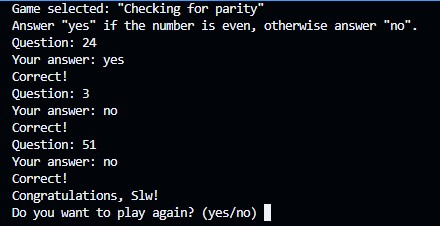
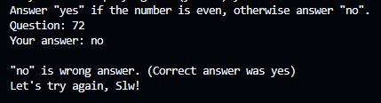
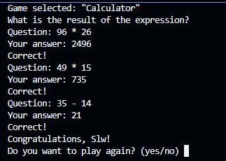
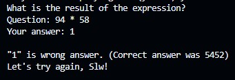
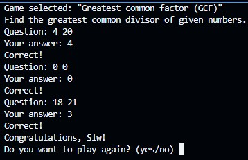
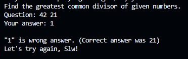
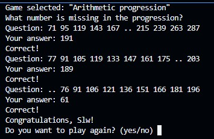
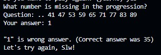
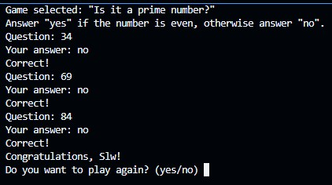
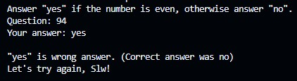

# Brain Games

[](https://nodejs.org/)
[](https://sonarcloud.io/project/overview?id=yarkastorskii_frontend-project-44)

---

## Описание проекта

**Brain Games** – это набор консольных мини-игр для тренировки логики и математического мышления.  
Каждая игра предлагает три вопроса. Чтобы победить, нужно дать три правильных ответа подряд. После прохождения можно выбрать другую игру или завершить сеанс.

**Доступные игры:**
1. **Проверка на чётность** – ответьте `yes`, если число чётное, иначе `no`.
2. **Калькулятор** – вычислите результат арифметического выражения (+, -, *).
3. **Наибольший общий делитель (НОД)** – найдите НОД двух чисел.
4. **Арифметическая прогрессия** – найдите пропущенное число в ряду из 10 элементов.
5. **Простое ли число?** – ответьте `yes`, если число простое, иначе `no`.

---

## Минимальные требования

- **Node.js** версии 14.0.0 или выше
- **npm**

---

## Установка и запуск

1. **Клонируйте репозиторий**  
   ```bash
   git clone https://github.com/yarkastorskii/frontend-project-44/tree/main
   cd frontend-project-44
   ```

2. **Установите зависимости**  
   ```bash
   npm install
   ```
   *Основная зависимость – `readline-sync` для ввода/вывода в консоли.*

3. **Запустите приложение**  
   ```bash
   node brain-games.js
   ```
   *Если файл имеет права на выполнение, можно использовать `./brain-games.js`.*

После запуска вас поприветствует программа, спросит имя и предложит выбрать игру.

---

## Игровой процесс

- После ввода имени вы увидите меню с 5 играми.  
- Введите номер игры (от 1 до 5) и нажмите Enter.  
- В каждой игре будет задано 3 вопроса. Отвечайте правильно, чтобы победить.  
- Если ответ неверен – игра завершится и предложит попробовать заново.  
- После победы программа спросит: «Do you want to play again?» (yes/no).  
  - `yes` – сыграть в **ту же игру** ещё раз.  
  - `no` – вернуться к выбору игр.

---

## Примеры игр

Ниже приведены записи, демонстрирующие успешный и неудачный проходы:

1. Игра «Проверка на чётность»
- **Успешное прохождение**

- **Неудачное прохождение**

2. Игра «Калькулятор»
- **Успешное прохождение**

- **Неудачное прохождение**

3. Игра «НОД»
- **Успешное прохождение**

- **Неудачное прохождение**

4. Игра «Арифметическая прогрессия»
- **Успешное прохождение**

- **Неудачное прохождение**

5. Игра «Простое число»
- **Успешное прохождение**

- **Неудачное прохождение**


---

## SonarQube

Проект регулярно анализируется с помощью **SonarQube**.  
Проверяются:
- дублирование кода,
- потенциальные ошибки,
- соблюдение соглашений о стиле

Бейдж в шапке `README` отражает текущее состояние качества кода – **Passed** (зелёный).

---

## Структура проекта

```
brain-games/
├── brain-games.js          # Главный файл – меню и выбор игры
├── games/
│   ├── evenGame.js         # Игра «Проверка на чётность»
│   ├── calcGame.js         # Игра «Калькулятор»
│   ├── gcfGame.js          # Игра «НОД»
│   ├── progressGame.js     # Игра «Арифметическая прогрессия»
│   └── isPrimeGame.js      # Игра «Простое число»
├── uni-f.js                # Вспомогательная функция atb (answer → boolean)
└── package.json            # Зависимости и скрипты
```